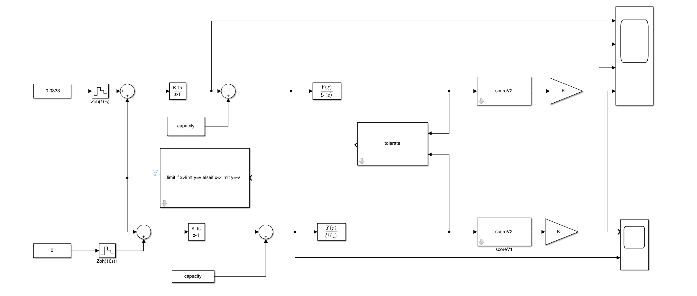
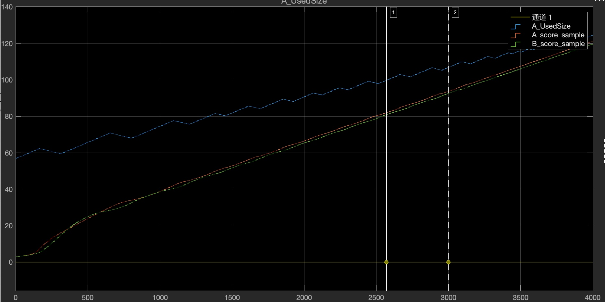

# tikv-simulink
## start
1. open file fold
2. run command in terminal:
```bash
[hma_nums,hma_dens]=hma(60)
```
3. double click score.slx
4. edit workspace model 
5. run  

## file use 
1. max_filter: get max value in n records 
2. hma.m: init hma params,return nums and dens 
3. pingcap.slx: some component such as score, tolerate 
4. test.slx: test for private component 


## result 
1. module view


2. result view


